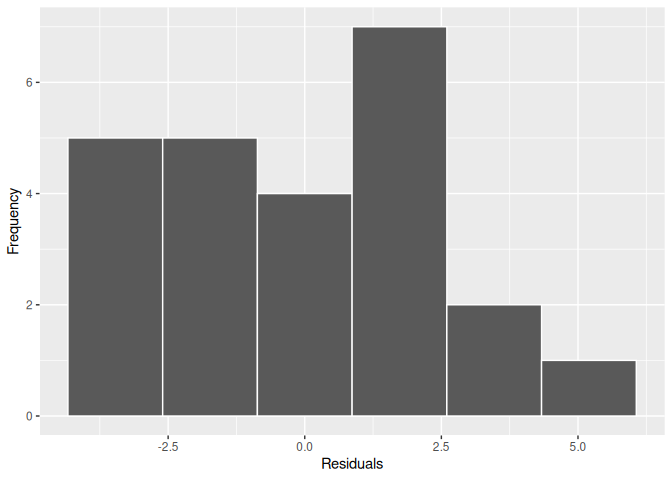
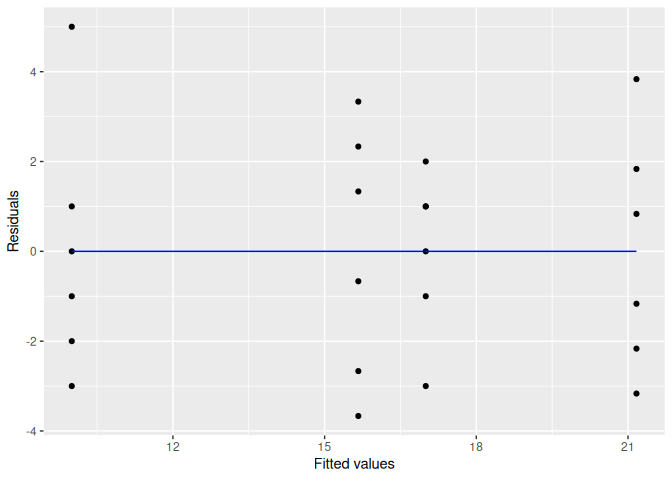

<!-- README.md is generated from README.Rmd. Please edit that file -->

# planex

<!-- badges: start -->
<!-- badges: end -->

Funções e bancos de dados para a disciplina de Planejamento de
Experimentos.

## Installation

Você pode instalar a versão de desenvolvimento do pacote planex a partir
do [GitHub](https://github.com/) da seguinte forma:

``` r
# install.packages("devtools")
devtools::install_github("fndemarqui/planex")
```

## Exemplo

``` r
library(planex)
#> Loading required package: dplyr
#> 
#> Attaching package: 'dplyr'
#> The following objects are masked from 'package:stats':
#> 
#>     filter, lag
#> The following objects are masked from 'package:base':
#> 
#>     intersect, setdiff, setequal, union
#> Loading required package: ggplot2
data(saquinhos)
saquinhos$concentracao <- as.factor(saquinhos$concentracao)
mod <- aov(resistencia ~ concentracao, data = saquinhos)
plotResiduals(mod)
```



``` r
testResiduals(mod)
#> 
#>  Shapiro-Wilk normality test
#> 
#> data:  resid
#> W = 0.96624, p-value = 0.5757
#> 
#> ------------------------------------------ 
#> Bartlett test of Homogeneity of Variances: 
#>              Bartlett's K-squared df   p.value
#> concentracao             1.135246  3 0.7685731
#> 
#> ----------------------------------------------- 
#> Durbin-Watson Test for Autocorrelated Errors: 
#>  lag Autocorrelation D-W Statistic p-value
#>    1      -0.1303884      2.181178   0.872
#>  Alternative hypothesis: rho != 0
summary(mod)
#>              Df Sum Sq Mean Sq F value   Pr(>F)    
#> concentracao  3  382.8  127.60   19.61 3.59e-06 ***
#> Residuals    20  130.2    6.51                     
#> ---
#> Signif. codes:  0 '***' 0.001 '**' 0.01 '*' 0.05 '.' 0.1 ' ' 1
```
