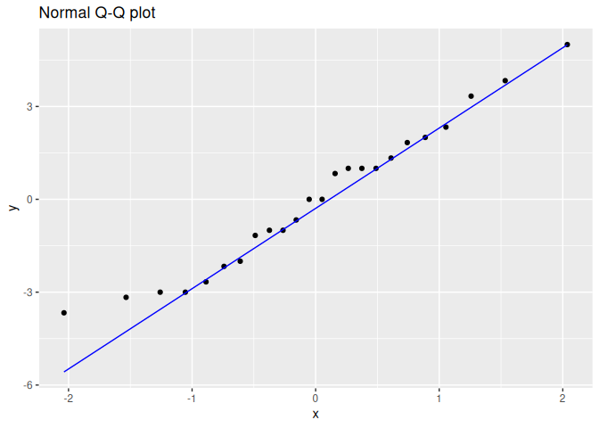

<!-- README.md is generated from README.Rmd. Please edit that file -->

# planex

<!-- badges: start -->
<!-- badges: end -->

Funções e bancos de dados para a disciplina de Planejamento de
Experimentos.

## Installation

Você pode instalar a versão de desenvolvimento do pacote planex a partir
do [GitHub](https://github.com/) da seguinte forma:

``` r
# install.packages("devtools")
devtools::install_github("fndemarqui/planex")
```

## Exemplo

``` r
library(planex)
#> Loading required package: ggplot2
data(saquinhos)

mod <- aov(resistencia ~ concentracao, data = saquinhos)
plotResiduals(mod)
```



``` r
summary(mod)
#>              Df Sum Sq Mean Sq F value   Pr(>F)    
#> concentracao  1  364.0   364.0   53.76 2.43e-07 ***
#> Residuals    22  148.9     6.8                     
#> ---
#> Signif. codes:  0 '***' 0.001 '**' 0.01 '*' 0.05 '.' 0.1 ' ' 1
```
